# AutoEval: Predictive Modeling for Used Car Pricing

## Authors
**Pavan Yellathakota**  
- Section-2 

**Nagaraju Mydam**  
- Section-1 

## Order of Execution

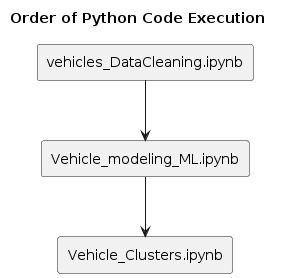  

## Dataset Overview
- **Source**: The [source](https://www. kagglecom/datasets/austinreese/craigslist-carstrucks-data) of this dataset is likely pre-owned car advertisements from Craigslist, made available on the [Kaggle](https://www. kaggle.com/) platform. 

- **Fields Summary**: The dataset includes fields such as id, url, region, region_url, price, year, manufacturer, model, condition, cylinders, fuel, odometer, title_status, transmission, VIN, drive, size, type, paint_color, image_url, description, county, state, lat, long, and posting_date. 

- **Data Collection and Relevance**: The information gathered from the online marketplace Craigslist is exclusively based on individual listings in nearby locations.  This information is a great tool for comparing used automobile prices for both individual buyers and sellers. 

## Project Objective
- **Prediction Target**: The main aim is to evaluate the selling price of pre-owned cars. 

- **Practical Application**: The created model can be smoothly incorporated into professional car trading platforms, aiding in automated price suggestions.  Moreover, it can function as a car price evaluation website for individual sellers and buyers.  This integration enriches user experience and boosts platform reliability. 

## Project Workflow
### Overview

**Initial Data Volume**: Initial dataset comprises 426,880 rows and 26 columns.  

**Initial Features Set**: The dataset includes features such as id, url, region, region_url, price, year, manufacturer, model, condition, cylinders, fuel, odometer, title_status, transmission, VIN, drive, size, type, paint_color, image_url, description, county, state, lat, long, and posting_date.  

### Data Cleaning and Preprocessing
The project initiated with data loading and preliminary examination, followed by cleansing processes including addressing infrequent brand names, handling missing values, removing outliers, managing redundant records, and eliminating unnecessary columns such as URLs and descriptions, etc.  

- **Ploting Percentage of Null values**: 

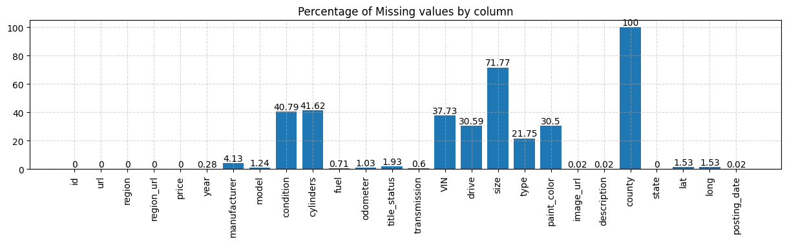  

- **Finding Outliers**: 

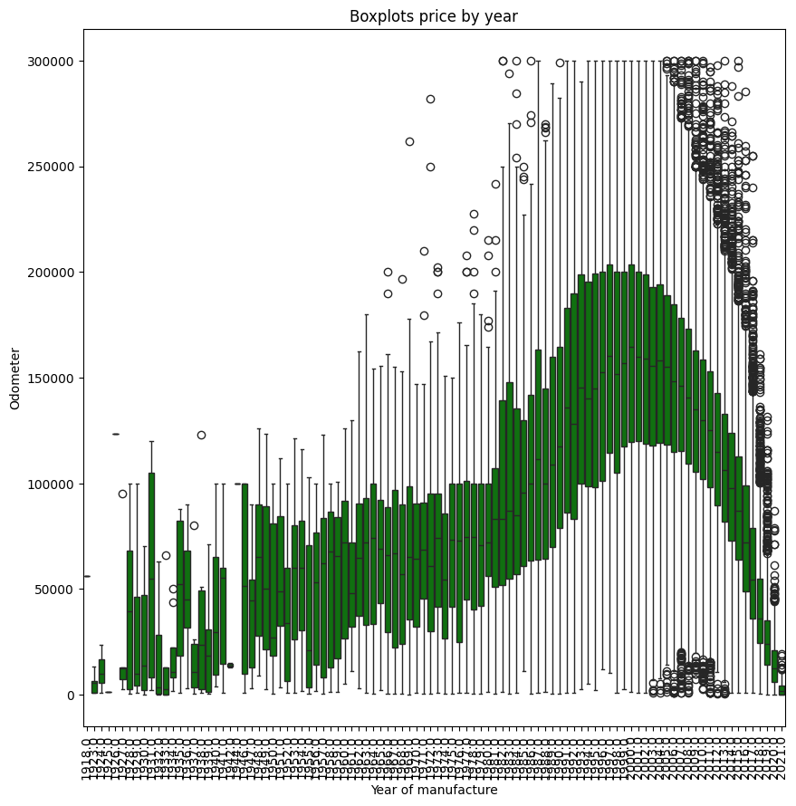  

**Cleaned Data Volume**: Post-cleansing, the dataset comprises 71094 rows and 15 columns.  

**Refined Feature Set**: The cleaned dataset retains features like id, region, price, year, manufacturer, model, condition, cylinders, fuel, odometer, transmission, drive, type, paint_color, description, state, lat, long, and posting_date.  

### Feature Engineering
- **Necessary Adjustments**: The inclusion of a derived attribute, "car_age," was also factored into the encoding process to mitigate potential biases in the data. 

- **Encoding Approaches**: Categorical features were appropriately encoded using both One-hot and Frequency encoding methods. 

- **Advanced Methods**: Feature transformations and scaling techniques were applied to numerical data to improve the effectiveness of the model. 

### Exploratory Data Analysis (EDA)

**Derived Feature**:  

                        Odometer_Price_Ratio  =  Odometer / Price
Calculating the Odometer_Price_Ratio is crucial for both buyers and sellers as it provides a concise indicator of a car's value proposition, aiding in comparison, pricing adjustments, predictive maintenance assessments, negotiation strategies, and marketing tactics, ultimately facilitating informed decision-making in the resale market.  

High Odometer_Price_Ratio: Potentially better value for the buyer because they are paying more for less mileage.  

Low Odometer_Price_Ratio: Potentially less value for the buyer because they are paying less for more mileage.  

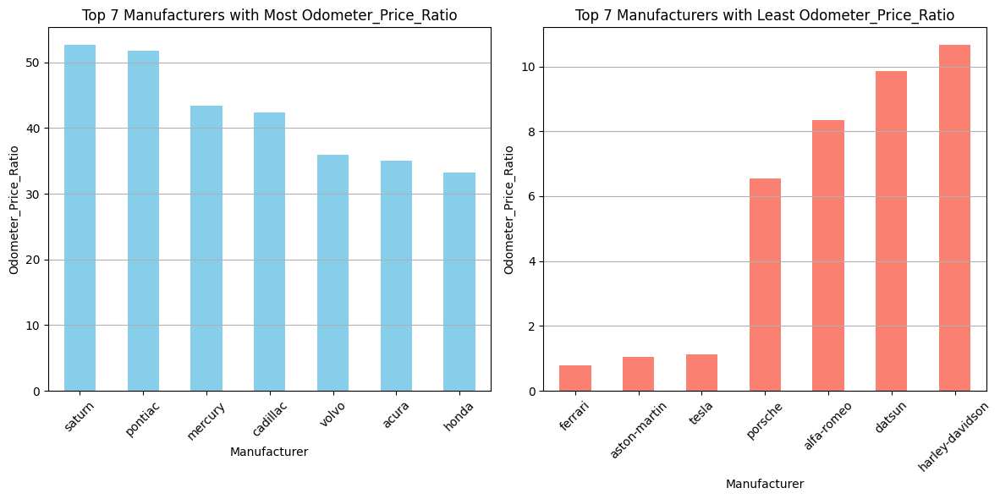  

Man_dep_OP (average_manufacturer_depreciation_per_odometer_price_ratio) : This clearly explains that the variable stores the average depreciation of a manufacturer or car make based on the ratio between the odometer reading and the price.

- **Predictors Variables**: Predictors (X) comprise car attributes like yodometer, condition_excellent,Man_dep_OP, condition_fair, condition_good,condition_like new, condition_new, fuel_diesel, fuel_electric,fuel_gas, fuel_hybrid, fuel_other, transmission_automatic,transmission_manual, transmission_other, drive_4wd, drive_fwd,drive_rwd, type_freq, manufacturer_freq, paint_color_freq,car_age_freq, cylinders_freq.  

- **Target Variable**: The target (Y) is the price. 
- **Problem Type**: Regressive analysis. 
- **Data Volume**: 71094 rows and 15 columns
- **Key Features Exploration**: Visual aids were employed to explore numerical attributes. 
- **Distribution Analysis (Y)**: Visual representations were utilized to analyze the distribution of prices, identifying common price points and ranges

- **Correlation Examination**: A correlation matrix was generated to reveal the relationships between the selling price and other attributes. 
  
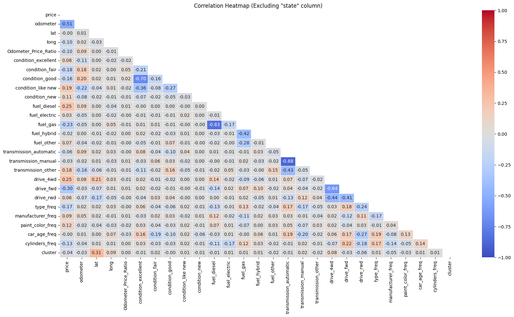  

**Visualization of Varience Distribution**: 

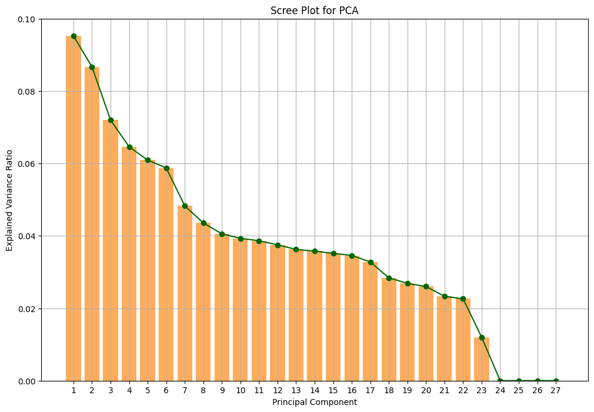  

**Clustering Data based on latitude and longitude**: 

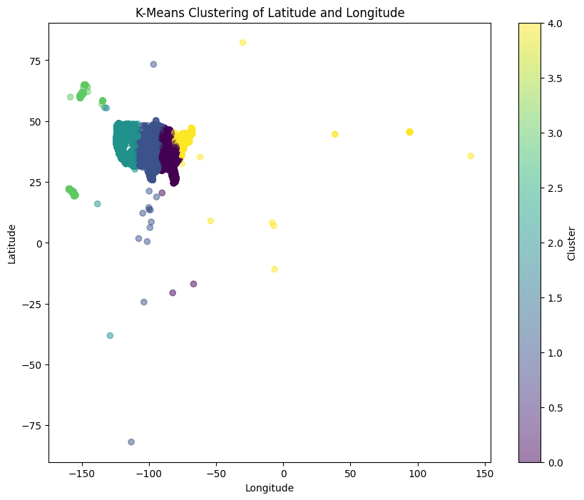  

- We can use the features 'State', 'lat' (Latitude), and 'long' (Longitude) to determine the geographical regions corresponding to each cluster   

## Model Development
- **Train/Test Split**: The dataset underwent division into training and test sets, 80 percent data is dedicated for training and the rest 20 percent for testing the model. 
- **Model Selection**: Linear regression, decision tree regression, Random Forest regression, and XGBoost regression were selected for the model to compare their abilities in handling non-linear relationships and to determine feature importances. 

## Validation and Performance Metrics
- **Evaluation Metrics**: Evaluation metrics such as R2_score, MSE, and RMSE were calculated to gauge model performance, emphasizing its proficiency in predicting real car prices. 

- **Model Evaluation**: Performance was elucidated through plots comparing actual and predicted values. 

- **Test Predictions**: Predictions on test data were showcased, comparing actual against predicted values to showcase model efficacy. 

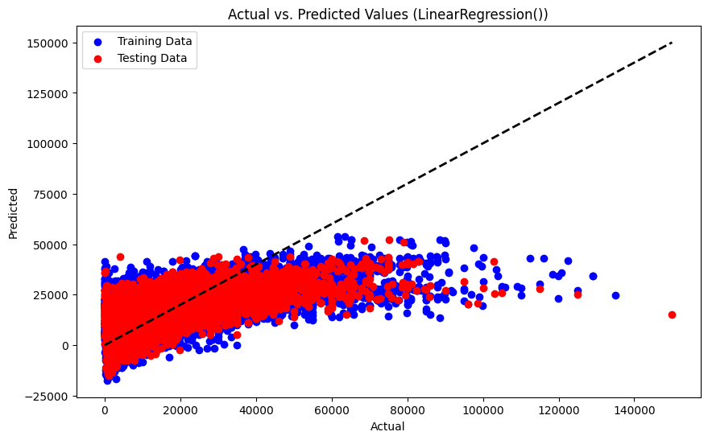  

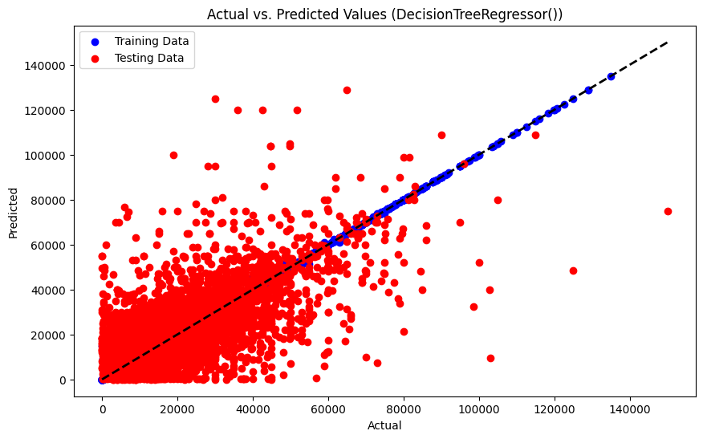  

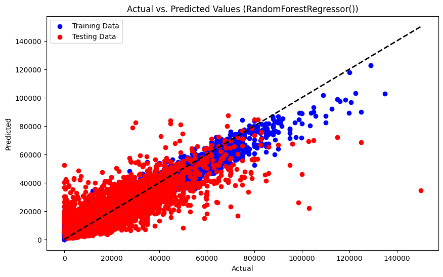  

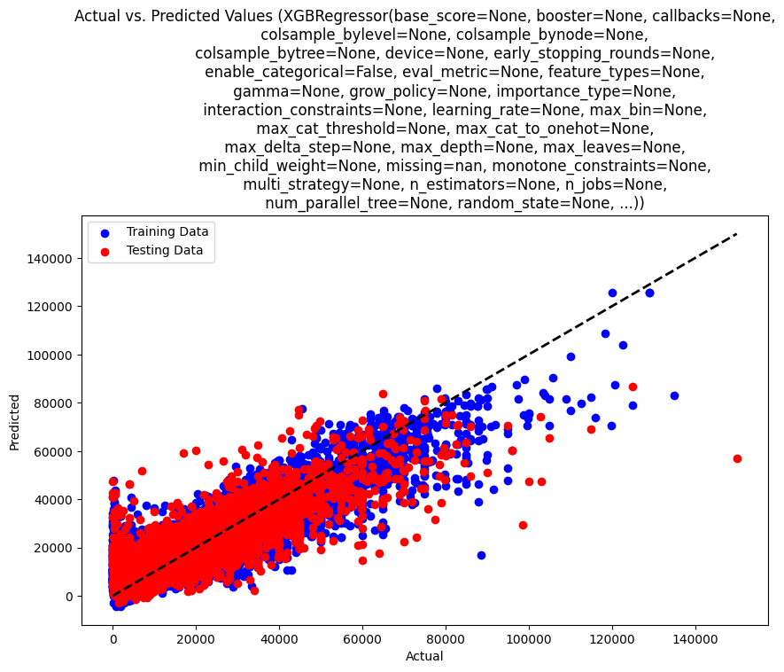  

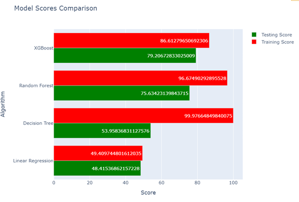  

- **Model Evaluation w.r.t Clusters**:  

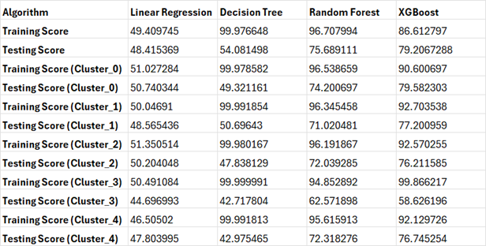  

**External Test Data for Prediction**: 

{'odometer': [95000], 
'condition_excellent': [1], 
'condition_fair': [0], 
'condition_good': [0], 
'condition_like new': [0], 
'condition_new': [0], 
'fuel_diesel': [0], 
'fuel_electric': [0], 
'fuel_gas': [1], 
'fuel_hybrid': [0], 
'fuel_other': [0], 
'transmission_automatic': [1], 
'transmission_manual': [0], 
'transmission_other': [0], 
'drive_4wd': [0], 
'drive_fwd': [1], 
'drive_rwd': [0], 
'type_freq': [0. 027], 
'manufacturer_freq': [0. 065], 
'paint_color_freq': [0. 151], 
'car_age_freq': [0. 063], 
'cylinders_freq': [0. 359]}

**Models Predicted Prices for External test data** 

 Models: [Random Forest, Decision Tree, XGBoost, Linear Regression ]
 Predicted prices: [14317.12, 14000.00, 11684.71,  12924.74 ]

## Production and Deployment
- **Deployment Recommendations**: The model can seamlessly integrate into professional pre-owned automobile trading platforms, offering automated price suggestions.  Additionally, it can serve as a car price evaluation website for individual sellers and buyers, enhancing user experience and platform reliability. 

- **Usage Precautions**: Regular updates and retraining with new data are advisable to maintain accuracy. 
## Future Prospects
- **Potential Enhancements**: Incorporating data from reputable professional car trading or pre-owned car selling platforms can enhance pricing evaluation based on various metrics. 

## Conclusion
- This project highlights the capability of machine learning to enhance the functionality of pre-owned automobile trading platforms and provide valuable insights into car pricing dynamics through predictive modeling.
- Based on the model evaluations, it is evident that Random Forest and XGBoost emerged as the top-performing models for the dataset under analysis. Moreover, both Random Forest and XGBoost demonstrated consistent performance across all clustered datasets.
